# Tricys-Plus 用户手册

- [Tricys-Plus 用户手册](#tricys-plus-用户手册)
  - [1. 背景介绍](#1-背景介绍)
  - [2. 使用方法](#2-使用方法)
  - [3. 配置参数](#3-配置参数)
    - [3.1. `co_simulation` 块详解](#31-co_simulation-块详解)
    - [3.2. 字段说明](#32-字段说明)
  - [4. 查看结果](#4-查看结果)
  - [5. 程序说明 (流程图)](#5-程序说明-流程图)
  - [6. 处理器接口规范 (Handler Interface)](#6-处理器接口规范-handler-interface)
    - [6.1. 函数签名](#61-函数签名)
    - [6.2. 输入参数](#62-输入参数)
    - [6.3. 返回值](#63-返回值)
    - [6.4. 实例解析：与 Aspen Plus 的交互](#64-实例解析与-aspen-plus-的交互)
  - [7. 核心工具 API 说明](#7-核心工具-api-说明)


## 1. 背景介绍

`tricys-plus` 是 `tricys` 仿真系统的一个高级扩展，其核心是提供一个强大的 **协同仿真 (Co-simulation)** 与 **模型拦截 (Model Interception)** 框架。

在标准的 `tricys` 仿真中，整个燃料循环系统完全在 OpenModelica 环境中进行计算。然而，在复杂的工程问题中，某些关键子系统的模型可能已经用其他专业软件（如 Aspen Plus, MATLAB）实现，这些模型直接在 Modelica 中重建既困难又耗时。

`tricys-plus` 正是为了解决这一挑战而生。它允许用户：
- **动态替换**：在不修改原始 Modelica 模型代码的情况下，将其中的一个或多个子系统替换为由外部程序驱动的“黑盒”模型。
- **数据驱动**：使用外部程序（称为“处理器”，Handler）的计算结果来驱动主仿真流程。

## 2. 使用方法

要使用 `tricys-plus` 框架，请遵循以下步骤：

1.  **编写处理器函数**
    -   创建一个 `.py` 文件（例如在 `tricys/handlers/` 目录下）。
    -   在文件中定义一个函数，确保它严格遵守第6节中描述的“处理器接口规范”。

2.  **配置 JSON 文件**
    -   打开您的 JSON 配置文件。
    -   确保顶层包含了 `co_simulation` 块。
    -   在 `co_simulation` 数组中，为您的协同仿真任务添加一个对象，并正确填写 `submodel_name`, `instance_name`, `handler_module`, `handler_function` 和 `params`。

3.  **运行命令**
    -   打开终端，安装项目。
    -   使用以下命令启动协同仿真工作流：
    ```bash
    tricys-plus -c path/to/your/config.json
    ```

## 3. 配置参数

`tricys-plus` 的所有行为都由一个 JSON 配置文件驱动。与标准仿真相比，其核心区别在于增加了一个名为 `co_simulation` 的顶层块。

当配置文件中存在 `co_simulation` 块时，程序将自动启用协同仿真工作流。

### 3.1. `co_simulation` 块详解

`co_simulation` 是一个 **数组**，允许在一次运行中配置多个、并行的拦截任务。数组中的每个对象都定义了一个独立的协同仿真任务。

以下是 `example_config.json` 中的一个配置示例：

```json
"co_simulation": [
    {
        "submodel_name": "example_model.DIV",
        "instance_name": "div",
        "handler_module": "tricys.handlers.div_handler",
        "handler_function": "run_div_simulation",
        "params": {
            "description": "This is a dummy handler for DIV.",
            "dummy_value": 123.45
        }
    },
    {
        "submodel_name": "example_model.I_ISS",
        "instance_name": "i_iss",
        "handler_module": "tricys.handlers.i_iss_handler",
        "handler_function": "run_aspen_simulation",
        "params": {
            "bkp_path": "example_aspenbkp/T2-Threetowers4.bkp",
            "base": 20,
            "retime": 60,
            "time_step": 3
        }
    }
]
```

### 3.2. 字段说明

-   `submodel_name` (str): **[必需]** 要拦截的子模型的 **完整 Modelica 类路径**。`tricys-plus` 会利用这个路径来识别该模型的输入和输出端口。
-   `instance_name` (str): **[必需]** 该子模型在顶层系统模型中的 **实例名称**。`tricys-plus` 需要用它来查找并修改 `connect` 语句。
-   `handler_module` (str): **[必需]** 实现了处理器接口的 Python **模块的路径**。例如 `tricys.handlers.aspen_handler`。
-   `handler_function` (str): **[必需]** 在上述模块中要调用的 **处理器函数的名称**。例如 `run_aspen_simulation`。
-   `params` (dict): **[可选]** 一个字典，包含了所有需要传递给处理器函数的自定义参数。这些参数会通过 `**kwargs` 传入处理器。

## 4. 查看结果

协同仿真工作流会生成一系列中间文件和最终结果，对于协同仿真的中间结果默认保存在 `results` 或 `temp` 目录中，对于拦截器Modelica模型则默认保存在OpenModelica运行模型目录中。

-   `primary_inputs_{job_id}.csv`:
    -   **内容**: 阶段1中，流入到待拦截模块输入端口的信号。
    -   **用途**: 主要用于调试处理器。检查输入给处理器的数据是否符合预期。

-   `{instance_name}_outputs_{job_id}.csv`:
    -   **内容**: 每个处理器在阶段2中生成的输出信号。
    -   **用途**: 调试处理器的计算结果。

-   `co_simulation_{job_id}.csv`:
    -   **内容**: **最终的仿真结果**。它是在运行被拦截后的新系统模型后得到的。
    -   **用途**: 这是整个工作流的主要产出，用于后续的数据分析和可视化。

-   `{SubModel}_Interceptor.mo`:
    -   **内容**: 自动生成的拦截器 Modelica 模型代码。
    -   **用途**: 了解拦截器内部结构，或在 Modelica 环境中单独调试。

-   `{SystemModel}_Intercepted.mo`:
    -   **内容**: 被自动修改和重连后的顶层系统模型。
    -   **用途**: 最终用于验证仿真的模型，可用于归档或在 OpenModelica 中手动打开查看。

## 5. 程序说明 (流程图)

`tricys-plus` 的工作流程被精确地编排为四个连续的阶段。

```mermaid
graph LR
    A[开始] --> B{加载 JSON 配置文件};
    B --> C["解析参数并生成仿真任务列表(笛卡尔积)"];
    C --> D{遍历每一个仿真任务};
    D --> E[开始单个任务的工作流];

    subgraph "工作流: 单个仿真任务(run_co_simulation_workflow)"
        E --> F["初始化 OpenModelica (OM) 会话"];

        subgraph "Stage 1: 主仿真 (获取输入)"
            F --> G[1.1. 识别所有待替换子模块的输入端口];
            G --> H[1.2. 运行一次完整的 Modelica 仿真];
            H --> I[1.3. 仅保存这些输入端口的时间序列数据到 'primary_inputs.csv'];
        end
   
        subgraph "Stage 2: 动态协同仿真 (可插拔部分)"
            I --> J[2.1. 循环遍历每个待替换的子模块];
            J --> K["2.2. 动态加载用户指定的外部 Python处理器 (handler)"];
            K --> L["2.3. 调用 handler, 将 'primary_inputs.csv' 作为其输入"];
            L --> M["2.4. handler 执行计算 (如: 外部程序调用等)"];
            M --> N["2.5. handler 将计算结果保存到独立的输出文件 (如: 'co_sim_outputs.csv')"];
            N --> J;
        end
   
        subgraph "Stage 3: 模型生成 (结果回插)"
            N --> O[3.1. 读取原始 Modelica 模型文件];
            O --> P["3.2. 自动生成一个新的 '拦截器'(Interceptor) Modelica 模型"];
            P --> Q["3.3. '拦截器'用查表方式读取 'co_sim_outputs.csv' 的数据来替换原始子模块的功能"];
        end
   
        subgraph "Stage 4: 验证仿真 (获取最终结果)"
            Q --> R[4.1. 加载并运行这个包含'拦截器'的新模型];
            R --> S[4.2. 使用用户指定的变量过滤器保存最终的仿真结果];
        end
   
        S --> T[关闭 OM 会话];
    end
   
    T --> U{所有任务完成?};
    U -- 否 --> D;
    U -- 是 --> V[结束];
```



-   **阶段 1: 运行主模型 (获取输入)**
    -   首先运行一次原始的、未经修改的 Modelica 系统模型。
    -   其**唯一目的**是记录下所有待拦截子模块（如 `i_iss`）的**输入端口**上的时序数据。
    -   结果保存到 `primary_inputs_{job_id}.csv`。

-   **阶段 2: 动态调用处理器 (执行外部计算)**
    -   `simulation_plus` 脚本根据配置，动态加载并执行相应的处理器函数（如 `run_aspen_simulation`）。
    -   将阶段 1 生成的 `primary_inputs.csv` 文件路径传给处理器。
    -   处理器执行其内部逻辑（如与 Aspen COM 对象交互），并将计算结果保存到 `..._outputs_{job_id}.csv` 文件。

-   **阶段 3: 生成拦截模型 (代码生成与修改)**
    -   `simulation_plus` 调用 `interceptor_utils.py` 中的核心功能。
    -   该工具首先为每个拦截任务自动生成一个新的 `..._Interceptor.mo` 模型文件。此模型内置了从 CSV 读取数据的 `CombiTimeTable` 组件。
    -   然后，它会读取原始的系统模型文件，通过正则表达式**自动修改** `connect` 语句，将新生成的拦截器实例“串联”到原有的连接中。
    -   最终生成一个全新的、被拦截的系统模型，如 `MySystem_Intercepted.mo`。

-   **阶段 4: 运行集成仿真 (获取最终结果)**
    -   加载并运行在阶段 3 中新生成的 `..._Intercepted.mo` 模型。
    -   由于此模型中的连接已被修改，并且拦截器会从 CSV 文件中读取数据，因此这次仿真的结果就是整个协同仿真工作流的最终结果。
    -   结果保存到 `co_simulation_{job_id}.csv`。


## 6. 处理器接口规范 (Handler Interface)

协同仿真的核心是“处理器”（Handler）。处理器是一个用户自定义的 Python 函数，它负责执行外部计算。为了让 `tricys-plus` 能够正确调用，任何处理器函数都必须遵循以下接口规范。


### 6.1. 函数签名

一个标准的处理器函数签名如下：

```python
def my_handler_function(temp_input_csv: str, temp_output_csv: str, **kwargs) -> dict:
    # ... 函数实现 ...
    return column_mapping
```

### 6.2. 输入参数

函数必须接收以下两个位置参数，以及可选的自定义参数：

-   `temp_input_csv` (str): **[必需]** 一个字符串，表示一个CSV文件的绝对路径。该文件由 `tricys-plus` 在 **阶段1** 自动生成，包含了驱动此处理器所需的所有上游模块的输出信号（时序数据）。处理器需要从此文件读取输入。
-   `temp_output_csv` (str): **[必需]** 一个字符串，表示一个CSV文件的绝对路径。处理器必须将其计算结果（时序数据）写入此路径。文件名由 `tricys-plus` 自动生成并传入。
-   `**kwargs` (dict): **[可选]** 一个字典，包含了所有在 JSON 配置文件中 `params` 块内定义的自定义参数。这为处理器提供了极大的灵活性，如传入 Aspen bkp 文件路径、算法阈值、开关选项等。

### 6.3. 返回值

函数执行完毕后，**必须**返回一个字典。

-   **功能**: 该字典用于告知 `tricys-plus`，在生成的拦截器模型中，如何将处理器输出的 CSV 文件中的数据列映射到被拦截模型的输出端口上。
-   **格式**:
    -   `key`: 字符串，被拦截模型的输出端口名 (例如 `"to_SDS"`)。
    -   `value`: 字符串，表示 Modelica 数组的字面量 (例如 `"{1,2,3,4}"`)。该数组的第一个元素必须是 `1`（代表时间列），后续元素代表 `temp_output_csv` 中对应的数据列索引。

### 6.4. 实例解析：与 Aspen Plus 的交互

`tricys.handlers.aspen_handler.py` 是一个与专业化工模拟软件 Aspen Plus 进行交互的典型处理器，它完美地诠释了接口规范的实际应用。

让我们分解其核心逻辑 `run_aspen_simulation` 函数，理解处理器如何作为 Modelica 和其他软件之间的“桥梁”：

1.  **建立与外部软件的通信**
    -   处理器首先通过 `win32com.client` 库启动 Aspen Plus 的 COM 服务，并加载指定的 `.bkp` 文件。这个文件路径正是通过 `**kwargs` 从 JSON 配置的 `params` 块中获取的。
    ```python
    # 通过 kwargs 获取 bkp_path
    aspen = AspenEnhanced(bkp_path)
    # AspenEnhanced 内部调用 win32com
    self.aspen = win32.Dispatch('Apwn.Document.40.0')
    self.aspen.InitFromArchive2(os.path.abspath(bkp_path))
    ```
    -   **关键点**: 这一步是特定于软件的。如果与 MATLAB 交互，可能会启动 MATLAB 引擎；如果与一个 Web API 交互，可能会初始化一个 HTTP 客户端。

2.  **接收并处理来自 Modelica 的输入**
    -   处理器使用 `pandas` 库读取 `tricys-plus` 传入的 `temp_input_csv` 文件，获取上游 Modelica 模块的输出。
    ```python
    df_input = pd.read_csv(temp_input_csv, encoding='gbk')
    ```
    -   它根据 Aspen 模型的要求，对输入数据进行筛选和转换，例如将质量流量转换为摩尔流量，并计算出六元组分比例。

3.  **循环驱动外部软件并交换数据**
    -   处理器的主体是一个循环，遍历从 Modelica 传入的每一个时间步的数据。
    -   在循环的每一步：
        -   **数据推送到 Aspen**: 将当前时间步计算好的组分比例等数据，通过 COM 接口写入 Aspen 模型内部的相应变量节点。
          ```python
          aspen.set_composition(ratios) # ratios 是从Modelica输入计算得来
          ```
        -   **触发 Aspen 计算**: 命令 Aspen 引擎运行一次计算。
          ```python
          aspen.run_step()
          ```
        -   **从 Aspen 获取结果**: 计算完成后，从 Aspen 模型中读取所需的输出流股结果。
          ```python
          stream_results = aspen.get_stream_results()
          ```

4.  **后处理并输出到 Modelica**
    -   所有时间步的数据都处理完毕后，处理器会对结果进行最终的整理，例如，`aspen_handler` 中考虑了 `retime`（延迟时间），使用 `shift(N)` 函数对结果进行时间上的平移。
    -   最后，它将格式化好的、最终要返回给 Modelica 的数据，使用 `pandas` 写入到 `tricys-plus` 指定的 `temp_output_csv` 文件路径。
    ```python
    out_df.to_csv(temp_output_csv, index=False)
    ```

5.  **返回列映射**
    -   函数最后返回一个字典，告诉拦截器模型如何读取 `temp_output_csv` 文件。
    ```python
    return {
        "to_SDS": "{1,2,3,4,1,1}",
        "to_WDS": "{1,5,6,7,1,1}",
    }
    ```

通过这个例子可以看出，处理器接口的设计是高度解耦的。`tricys-plus` 框架不关心处理器内部做了什么（是调用 Aspen 还是其他程序），它只负责提供输入（`temp_input_csv`）和定义输出规范（`temp_output_csv` 和返回值），使得集成任何外部系统都成为可能。


## 7. 核心工具 API 说明 

本节详细介绍 `tricys-plus` 工作流中用于模型生成与修改的核心工具函数。

-   **`_generate_interceptor(submodel_name: str, output_ports: list, csv_file: str) -> tuple[str, str]`**
    -   **功能**: 内部辅助函数，用于动态生成一个“拦截器”模型的 Modelica 源代码。这个拦截器模型是一个包装器，它拥有与原始子模型相同的输出端口，但其内部逻辑被替换为一个 `CombiTimeTable` 组件，该组件从指定的 CSV 文件中读取数据来驱动输出。
    -   **参数**:
        -   `submodel_name` (str): 要拦截的子模型的完整名称 (例如 `example_model.I_ISS`)。
        -   `output_ports` (list): 从原始子模型中解析出的输出端口信息列表。
        -   `csv_file` (str): 供 `CombiTimeTable` 读取的数据源 CSV 文件的路径。
    -   **返回**: 一个元组，包含：
        -   `interceptor_name` (str): 生成的拦截器模型的名称 (例如 `I_ISS_Interceptor`)。
        -   `model_template` (str): 完整的 Modelica 模型代码字符串。

-   **`integrate_interceptor_model(package_path: str, model_name: str, interception_configs: list) -> dict`**
    -   **功能**: 这是执行模型拦截的核心函数。它读取一个顶层系统模型，并根据配置自动生成、实例化和重连一个或多个拦截器模型，最终生成一个被修改后的、可用于协同仿真的新系统模型。
    -   **流程**:
        1.  为 `interception_configs` 中的每个任务调用 `_generate_interceptor` 来创建对应的 `.mo` 文件。
        2.  读取顶层系统模型的代码。
        3.  在系统模型中添加对新生成的拦截器模型的实例化声明。
        4.  使用正则表达式查找并修改 `connect` 语句，将原始组件的连接重定向到通过拦截器实例。
        5.  将修改后的系统模型代码保存到一个新的文件（通常以 `_Intercepted.mo` 结尾）。
    -   **参数**:
        -   `package_path` (str): 包含所有模型定义的 `package.mo` 文件的路径。
        -   `model_name` (str): 要修改的顶层系统模型的完整名称 (例如 `example_model.Cycle`)。
        -   `interception_configs` (list): 一个字典列表，每个字典定义了一个拦截任务，包含 `submodel_name`, `instance_name`, `csv_uri` 等关键信息。
    -   **返回**: 一个字典，包含：
        -   `interceptor_model_paths` (list): 所有生成的拦截器 `.mo` 文件的路径列表。
        -   `system_model_path` (str): 修改后的新系统模型的 `.mo` 文件路径。 
