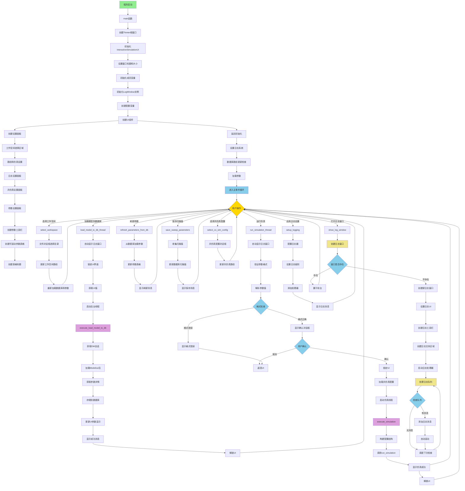

# Tricys 用户手册

**Tricys (TRitium Integrated CYcle Simulation)** 是一个基于 OpenModelica 的高级仿真平台，旨在分析和研究聚变燃料循环的动态行为。它提供了强大的参数扫描和协同仿真功能，以满足从初步研究到详细系统集成的不同需求。

---

- [Tricys 用户手册](#tricys-用户手册)
  - [1. 核心功能](#1-核心功能)
      - [工作流程 (Workflows)](#工作流程-workflows)
      - [运行模式 (Execution Modes)](#运行模式-execution-modes)
  - [2. 安装指南](#2-安装指南)
    - [2.1. Docker 环境](#21-docker-环境)
    - [2.2. Windows 本地环境](#22-windows-本地环境)
  - [3. 核心概念](#3-核心概念)
    - [3.1. 工作区 (Workspace)](#31-工作区-workspace)
    - [3.2. 配置文件 (`config.json`)](#32-配置文件-configjson)
    - [3.3. 高级参数定义](#33-高级参数定义)
  - [4. 示例说明 (Example Files)](#4-示例说明-example-files)
  - [5. 使用: 命令行 (CLI)](#5-使用-命令行-cli)
    - [5.1. 标准参数扫描](#51-标准参数扫描)
    - [5.2. 混合协同仿真](#52-混合协同仿真)
  - [6. 使用: 图形界面 (GUI)](#6-使用-图形界面-gui)
    - [6.1. 界面布局](#61-界面布局)
    - [6.2. 操作流程](#62-操作流程)
      - [第 1 步：设置工作区和全局配置](#第-1-步设置工作区和全局配置)
      - [第 2 步：加载模型参数](#第-2-步加载模型参数)
      - [第 3 步：定义参数扫描](#第-3-步定义参数扫描)
      - [第 4 步 (可选): 协同仿真配置](#第-4-步-可选-协同仿真配置)
      - [第 5 步：运行仿真](#第-5-步运行仿真)
    - [6.3. 其他功能按钮](#63-其他功能按钮)
  - [7. 结果与输出](#7-结果与输出)
    - [7.1. 最终结果](#71-最终结果)
      - [`simulation_result.csv`](#simulation_resultcsv)
      - [`sweep_results.csv`](#sweep_resultscsv)
      - [`rises_info.csv`](#rises_infocsv)
    - [7.2. 日志与临时文件](#72-日志与临时文件)
  - [8. 开发者指南: 扩展 Tricys](#8-开发者指南-扩展-tricys)
    - [8.1. 创建自定义处理器 (Handler)](#81-创建自定义处理器-handler)
      - [步骤 1: 创建一个 Python 函数](#步骤-1-创建一个-python-函数)
      - [步骤 2: 实现函数逻辑](#步骤-2-实现函数逻辑)
      - [步骤 3: 定义返回值](#步骤-3-定义返回值)
      - [步骤 4: 配置 `config.json`](#步骤-4-配置-configjson)
    - [8.2. 代码架构 (Utils API)](#82-代码架构-utils-api)
      - [`sim_utils.py` - 仿真任务生成器](#sim_utilspy---仿真任务生成器)
      - [`om_utils.py` - OpenModelica 交互核心](#om_utilspy---openmodelica-交互核心)
      - [`db_utils.py` - 参数数据库接口](#db_utilspy---参数数据库接口)
      - [`file_utils.py` \& `log_utils.py` - 文件与日志工具](#file_utilspy--log_utilspy---文件与日志工具)
      - [`plot_utils.py` - 结果绘图工具](#plot_utilspy---结果绘图工具)
  - [9. 流程图](#9-流程图)
    - [9.1. 命令行 (CLI) 工作流程](#91-命令行-cli-工作流程)
    - [9.2. 图形界面 (GUI) 工作流程](#92-图形界面-gui-工作流程)

---

## 1. 核心功能

Tricys 提供了灵活的仿真能力，其具有 **两种工作流程** 和 **两种运行模式**。

#### 工作流程 (Workflows)

1.  **标准参数扫描 (Standard Parameter Sweep)**
    -   **用途**: 研究一个或多个模型参数变化对系统行为的影响。
    -   **工作方式**: 用户在配置文件或 GUI 中定义参数的扫描范围。Tricys 会自动生成所有参数组合（笛卡尔积），并并行或顺序地执行每一次独立的仿真，最后将结果汇总。

2.  **混合协同仿真 (Hybrid Co-Simulation)**
    -   **用途**: 将 Modelica 模型与外部程序（如 Aspen Plus、MATLAB 或自定义的 Python 脚本）进行集成，实现更复杂的系统级仿真。
    -   **工作方式**: 此工作流通过一个“运行-处理-再运行”的自动化流程，将 Modelica 与外部工具（如 Aspen Plus 或自定义 Python 脚本）连接起来。首先，它运行一次初步的 Modelica 仿真以生成数据；接着，将这些数据交给用户定义的“处理器”(Handler)进行外部计算或处理；最后，Tricys 会动态地将处理器的结果（通常是 CSV 数据）“注入”回 Modelica 模型中，并运行一次最终的、完整的系统仿真。这个过程允许将外部工具的复杂计算能力无缝集成到 Modelica 的仿真环境中。

#### 运行模式 (Execution Modes)

为了执行上述工作流程，Tricys 提供两种操作界面：

1.  **命令行界面 (CLI)**: 通过 `tricys` 命令和 JSON 配置文件驱动，适合进行大规模的自动化计算、批量任务和集成到其他脚本或工作流中。
2.  **图形用户界面 (GUI)**: 通过 `tricys-gui` 命令启动，提供一个直观的交互式环境，用户可以方便地加载模型、设置仿真参数、定义扫描范围并启动仿真。

## 2. 安装指南

### 2.1. Docker 环境 

为简化配置，我们提供两个预配置的镜像：

-   `ghcr.io/asipp-neutronics/tricys_openmodelica_gui:docker_dev`: 包含完整的图形环境和 OMEdit 可视化工具。
-   `ghcr.io/asipp-neutronics/tricys_openmodelica_ompython:docker_dev`: 轻量级镜像，不含 OMEdit。

**环境要求**:
-   Docker & Docker Compose
-   VSCode (已安装 Dev Containers 插件)
-   Windows 11 (启用 WSL2) 或 Linux (需运行 `xhost +local:` 以支持 GUI)

**安装步骤**:
1.  克隆仓库: `git clone https://github.com/asipp-neutronics/tricys.git && cd tricys`
2.  在 VSCode 中打开: `code .`
3.  点击右下角弹出的 “Reopen in Container” 提示。
4.  容器启动后，在 VSCode 的终端中运行 `make dev-install` 来安装所有依赖。

### 2.2. Windows 本地环境

此安装方式适用于希望在本地直接运行，或需要进行涉及仅限 Windows 的软件（如 Aspen Plus）的协同仿真用户。
> **重要提示**: 项目中提供的 `i_iss_handler` 处理器通过 COM 接口与 Aspen Plus 进行交互。由于 Aspen Plus 和 COM 技术仅限于 Windows 平台，任何涉及 Aspen Plus 的协同仿真任务 **必须在 Windows 本地环境下运行**，而不能在 Docker 容器中执行。因此，如果您需要进行此类协同仿真，请选择 [Windows 本地环境](#22-windows-本地环境) 进行安装和使用。
> 
**环境要求**:
-   Python (>=3.8, 安装时勾选 "Add Python to PATH")
-   Git
-   OpenModelica (确保 `omc.exe` 在系统 PATH 中)

**安装步骤**:
1.  克隆仓库: `git clone https://github.com/asipp-neutronics/tricys.git && cd tricys`
2.  创建虚拟环境: `py -m venv venv && .\venv\Scripts\activate`
3.  安装依赖: `Makefile.bat win-install`


## 3. 核心概念

### 3.1. 工作区 (Workspace)

Tricys 的所有相对路径（如模型、数据库、结果目录等）都是相对于其**工作区**目录解析的。默认情况下，工作区是您启动 `tricys` 或 `tricys-gui` 命令时所在的目录。在 GUI 模式下，您可以随时切换工作区。

### 3.2. 配置文件 (`config.json`)

这是驱动所有仿真的核心文件，其主要结构如下：

```json
{
    "paths": { ... },
    "logging": { ... },
    "simulation": { ... },
    "simulation_parameters": { ... },
    "co_simulation": [ ... ]
}
```

-   `paths`: 定义所有相关的文件和目录路径（相对于工作区）。
-   `logging`: 配置日志记录行为。
-   `simulation`: 定义核心仿真参数，如模型名称、仿真时长、步长、是否并行 (`concurrent`) 等。
-   `simulation_parameters`: **参数扫描的核心**。在这里定义要变化的模型参数及其扫描值。
-   `co_simulation`: **(可选)** 定义协同仿真任务。如果此字段存在，Tricys 将切换到协同仿真工作流。

### 3.3. 高级参数定义

在 `simulation_parameters` 中，您可以使用多种高级格式来定义参数值，以实现灵活的扫描：

| 功能 | 格式 | 示例 | 说明 |
| :--- | :--- | :--- | :--- |
| **列表** | `[v1, v2, ...]` | `[6, 12, 18]` | 定义一组离散的扫描值。 |
| **范围** | `"start:stop:step"` | `"1.05:1.15:0.05"` | 生成等差序列。 |
| **线性间隔** | `"linspace:start:stop:num"` | `"linspace:10:20:5"` | 生成 `num` 个等间距点。 |
| **对数间隔** | `"log:start:stop:num"` | `"log:1:1000:4"` | 生成 `num` 个对数尺度的点。 |
| **随机值** | `"rand:min:max:count"` | `"rand:15:25:10"` | 生成 `count` 个均匀分布的随机数。 |
| **从文件读取** | `"file:path:column"` | `"file:data.csv:voltage"` | 从 CSV 文件的指定列读取数据。 |
| **数组参数** | `"{v1, v2, ...}"` | `"{10, 20.5, '1.05:1.15:0.05'}"` | 将字符串解析为独立的索引参数，如 `param[1]=10`。 |

## 4. 示例说明 (Example Files)

项目根目录下的 `example/` 文件夹包含了多种预设的配置文件和模型，旨在帮助用户快速上手和测试不同的功能。该文件夹的结构如下：

-   **`example/cli/`**: 包含所有用于**命令行 (CLI)** 模式的示例。
    -   `simulation_concurrent/`: 标准参数扫描（并行）。
    -   `simulation_non_concurrent/`: 标准参数扫描（顺序）。
    -   `co_simulation_concurrent/`: 混合协同仿真（并行）。
    -   `co_simulation_non_concurrent/`: 混合协同仿真（顺序）。
    -   每个子文件夹都包含一个 `example_config.json` 文件和相应的 `example_model` (Modelica 模型) 及 `example_aspenbkp` (Aspen Plus 模型) 等资源。

-   **`example/gui/`**: 包含用于**图形用户界面 (GUI)** 模式的示例资源。
    -   `co_config.json`: 一个预设的协同仿真配置文件，可以在 GUI 中加载。
    -   `example_model/` 和 `example_aspenbkp/`: 与 CLI 示例共享的模型资源。

-   **`example/parameters/`**: 包含演示高级参数定义格式的配置文件。

**如何使用示例:**

-   **CLI 用户**: 首先使用 `cd` 命令进入您想运行的示例目录，然后使用 `-c` 参数指向该目录下的 `example_config.json` 文件。
    ```bash
    # 运行一个并行的协同仿真示例
    cd example/cli/co_simulation_concurrent
    tricys -c example_config.json
    ```
-   **GUI 用户**: 推荐将工作区设置为 `example/gui/` 目录。这样，GUI 中的默认路径（如 `example_model/package.mo`）就能正确指向示例模型。然后，您可以加载 `co_config.json` 文件来快速配置协同仿真任务。

## 5. 使用: 命令行 (CLI)

### 5.1. 标准参数扫描

1.  确保您的 `config.json` 文件中**不包含** `co_simulation` 字段。
2.  在 `simulation_parameters` 中定义您想扫描的参数。
3.  运行命令: `tricys -c path/to/your_config.json`

### 5.2. 混合协同仿真

您同样可以在配置文件中定义 `simulation_parameters` 块。当 `co_simulation` 和 `simulation_parameters` 同时存在时，Tricys 会对参数扫描中的每一个点，完整地执行一次协同仿真流程。

1.  在 `config.json` 文件中加入 `co_simulation` 字段。该字段是一个列表，每个元素代表一个协同仿真任务。

    ```json
    "co_simulation": [
        {
            "submodel_name": "example_model.I_ISS",
            "instance_name": "i_iss",
            "handler_module": "tricys.handlers.i_iss_handler",
            "handler_function": "run_aspen_simulation",
            "params": {
                "bkp_path": "example_aspenbkp/T2-Threetowers4.bkp",
                "retime": 60
            }
        }
    ]
    ```
    -   `submodel_name`: 要被拦截和替换的 Modelica 子模型的完整名称。
    -   `instance_name`: 该子模型在主系统模型中的实例名称。
    -   `handler_module`: 包含处理器函数的 Python 模块的路径。
    -   `handler_function`: 要调用的处理器函数的名称。
    -   `params`: 一个字典，包含要传递给处理器函数的关键字参数。

2.  运行命令: `tricys -c path/to/your_co_sim_config.json`

## 6. 使用: 图形界面 (GUI)

图形用户界面 (GUI) 提供了一个功能齐全的交互式环境，用于配置和运行标准仿真及协同仿真任务。所有在 GUI 中设置的相对路径都将基于当前选定的工作区进行解析。

**启动 GUI**: `tricys-gui`


### 6.1. 界面布局

GUI 界面主要分为两个核心区域：

1.  **设置区 (Settings)**: 位于上方，用于配置仿真的全局参数和环境。这包括：
    *   **工作区 (Workspace)**: 定义所有相对路径的根目录。
    *   **路径设置**: Modelica 包 (`package.mo`)、参数数据库 (`.db`)、结果和临时目录的路径。
    *   **仿真设置**: 模型名称、仿真时长、步长、求解器容差、并行工作线程数等。
    -   **日志设置**: 日志级别、保存目录和数量。
    *   **协同仿真设置**: 用于启用和配置协同仿真任务。

2.  **参数区 (Parameters)**: 位于下方，是进行参数查看和扫描设置的主要区域。它包含一个参数表格和一系列操作按钮。

### 6.2. 操作流程

无论是进行标准仿真还是协同仿真，推荐的操作流程如下：

#### 第 1 步：设置工作区和全局配置

-   **选择工作区**: 启动 GUI 后，首先通过 **`Browse...`** 按钮设置您的工作区目录。这是确保所有相对路径（如模型、数据库、结果等）被正确解析的关键。
-   **填写设置**: 检查并填写“设置区”中的所有字段，如模型路径、结果目录、仿真时长等。

#### 第 2 步：加载模型参数

-   点击 **`Load Model to DB`** 按钮。这是使用 GUI 的**核心步骤**。
-   Tricys 将调用 OpenModelica 解析您指定的模型，提取其所有参数的详细信息（名称、默认值、注释等），并将这些信息存入由 `Database Path` 指定的 SQLite 数据库文件中。
-   加载成功后，下方的“参数区”表格将自动填充所有模型参数。

#### 第 3 步：定义参数扫描

-   在参数表格的 **`Sweep Value`** 列中，为您希望扫描的参数填入扫描值。
-   **重要**: GUI 的 `Sweep Value` 输入框同样支持在[高级参数定义](#33-高级参数定义)中描述的所有格式，包括：
    -   **列表**: `[1.0, 1.5, 2.0]`
    -   **范围**: `"1.05:1.15:0.05"`
    -   **Linspace**: `"linspace:10:20:5"`
    -   **从文件读取**: `"file:data/input.csv:column_name"`
-   如果某个参数的 `Sweep Value` 留空，仿真时将使用其默认值。

#### 第 4 步 (可选): 协同仿真配置

-   如果您需要运行协同仿真，请勾选 **`Enable Co-simulation`** 复选框。
-   点击 **`Browse...`** 按钮，选择一个包含 `co_simulation` 配置块的 JSON 文件。
-   **注意**: 此配置文件**仅**用于提供协同仿真的处理器 (Handler) 配置。所有其他的仿真参数（如 `stop_time`, `step_size`）以及在参数表格中定义的参数扫描，都将以 GUI 中的设置为准。

#### 第 5 步：运行仿真

-   点击 **`Run Simulation`** 按钮。
-   系统会弹出一个确认对话框，列出所有将被应用的扫描参数，供您最终检查。
-   确认后，仿真将在后台线程中开始执行，界面不会冻结。
-   您可以点击 **`Open the log window`** 按钮打开实时日志窗口，以监控仿真进度和查看详细输出。
-   仿真结束后，会弹出“成功”或“失败”的提示框。

### 6.3. 其他功能按钮

-   **`Refresh From DB`**: 如果数据库文件被外部程序修改，点击此按钮可从数据库重新加载参数到 UI。
-   **`Save Sweep Values to DB`**: 将当前在 `Sweep Value` 列中输入的所有扫描配置保存到数据库，方便未来重新加载使用。

## 7. 结果与输出

### 7.1. 最终结果

每次运行 `tricys` 或 `tricys-gui` 都会在您配置的结果目录 (`results_dir`) 内创建一个以时间戳命名的唯一子目录（例如 `results/20230901_103000/`）。这确保了每次运行的结果都相互隔离，便于管理和追溯。

在该目录中，您可能会找到以下几种输出文件：

#### `simulation_result.csv`
-   **生成条件**: 当进行单次仿真（即没有参数扫描）时生成。
-   **内容**: 一个标准的 CSV 文件，第一列是 `time`，其余列是您通过 `variableFilter` 指定的变量的时间序列数据。

#### `sweep_results.csv`
-   **生成条件**: 当进行参数扫描时生成。
-   **内容**: 这是一个汇总文件，用于比较不同参数下的仿真结果。
    -   第一列是 `time`。
    -   其余每一列代表一次独立的仿真运行。列的名称由该次运行所使用的参数组合而成，格式为 `参数1=值1_参数2=值2_...`，例如 `blanket.T=6_i_iss.T=18.0`。
    -   这使您可以轻松地在数据分析工具（如 Excel, Pandas）中筛选和绘制特定参数组合下的结果曲线。

#### `rises_info.csv`
-   **生成条件**: 在参数扫描过程中，如果检测到某些结果曲线表现出特定的“先降后升”行为，则会生成此文件。
-   **内容**: 记录了哪些参数组合导致了这种特定行为，便于快速识别和分析某些动态特性。

### 7.2. 日志与临时文件

在进行复杂的仿真或问题排查时，理解日志和临时文件的结构至关重要。

-   **时间戳关联**: 每次运行 `tricys` 命令都会生成一个唯一的时间戳（如 `20230901_103000`）。这个时间戳会同时用于命名**结果子目录**、**日志文件**和**临时工作目录**，从而将一次运行的所有产物关联起来。
    -   **结果目录**: `results/20230901_103000/`
    -   **日志文件**: `log/simulation_20230901_103000.log`
    -   **临时目录**: `temp/20230901_103000/`

-   **临时文件 (`temp` 目录)**: 在仿真过程中，Tricys 会在 `temp/<timestamp>/` 目录下为每个独立的仿真任务（job）创建一个工作区（如 `job_1`, `job_2`）。这里存放了该任务的所有中间产物，包括模型副本、生成的代码、以及单次运行的原始结果 CSV。这对于调试特定参数组合的失败非常有用。
    -   默认情况下，为了节省空间，这些临时文件在仿真成功结束后会被**自动删除**。
    -   要保留这些文件，请在 `config.json` 的 `simulation` 部分设置 `"keep_temp_files": true`。

## 8. 开发者指南: 扩展 Tricys

### 8.1. 创建自定义处理器 (Handler)

您可以轻松编写自己的处理器来将任何外部程序集成到协同仿真工作流中。下面是创建处理器的通用步骤，并以项目中的 `i_iss_handler` 为例进行说明，该处理器用于集成 Aspen Plus。

#### 步骤 1: 创建一个 Python 函数

您的函数必须遵循特定的签名，接受至少两个标准参数，以及任意数量的自定义关键字参数。

-   `temp_input_csv` (str): 这是主仿真生成的、包含输入数据的时间序列 CSV 文件的路径。
-   `temp_output_csv` (str): 这是您的函数必须写入的、包含最终输出的时间序列 CSV 文件的路径。
-   `**kwargs`: 所有在 `config.json` 的 `params` 块中定义的额外参数都将通过关键字参数传递给您的函数。

**示例 (`i_iss_handler.py`):**
```python
def run_aspen_simulation(
    temp_input_csv: str, 
    temp_output_csv: str, 
    bkp_path: str, 
    retime: int, 
    **kwargs
):
    # ... 函数实现 ...
```
在这个例子中，`bkp_path` 和 `retime` 就是从 `config.json` 的 `params` 中传入的自定义参数。

#### 步骤 2: 实现函数逻辑

在函数内部，您可以执行任何所需的操作。

**示例 (`i_iss_handler.py`):**
1.  **初始化**: 使用 `win32com.client` 通过 COM 接口启动并连接到 Aspen Plus，并加载由 `bkp_path` 参数指定的 Aspen 模型文件。
2.  **读取输入**: 使用 Pandas 读取 `temp_input_csv` 文件中的数据。
3.  **循环计算**: 遍历输入数据，在每个时间步将数据发送到 Aspen Plus，运行 Aspen 的内部计算，然后获取结果。
4.  **后处理**: 对从 Aspen 获取的结果进行处理和计算，生成最终的时间序列数据。
5.  **写入输出**: 将最终计算得到的时间序列数据保存到 `temp_output_csv` 文件中。

#### 步骤 3: 定义返回值

处理器函数必须返回一个字典，该字典用于在生成拦截器模型时，为被替换的输出端口提供一个临时的、语法正确的占位符。这个占位符在最终仿真中**不会被使用**，但对于让 Modelica 模型在语法上通过检查是必需的。

**示例 (`i_iss_handler.py`):**
```python
    output_placeholder = {
        "to_SDS": "{1,2,3,4,1,1}",
        "to_WDS": "{1,5,6,7,1,1}",
    }
    return output_placeholder
```
这里的键（`to_SDS`, `to_WDS`）是被拦截的 `I_ISS` 模型的输出端口名，值是符合 Modelica 数组语法的字符串。

#### 步骤 4: 配置 `config.json`

最后，在 `config.json` 的 `co_simulation` 块中，将 `handler_module` 和 `handler_function` 指向您创建的模块和函数，并在 `params` 中提供所有自定义参数。

**示例 (`config.json`):**
```json
"co_simulation": [
    {
        "submodel_name": "example_model.I_ISS",
        "instance_name": "i_iss",
        "handler_module": "tricys.handlers.i_iss_handler",
        "handler_function": "run_aspen_simulation",
        "params": {
            "bkp_path": "example_aspenbkp/T2-Threetowers4.bkp",
            "retime": 60
        }
    }
]
```

### 8.2. 代码架构 (Utils API)

`tricys/utils/` 目录包含了平台的核心工具模块，为上层仿真流程提供支持。理解这些模块的功能对于二次开发和扩展至关重要。

#### `sim_utils.py` - 仿真任务生成器

这是所有仿真运行的起点。它负责解析用户在配置文件或 GUI 中定义的参数，并生成一个包含所有独立仿真任务（Jobs）的列表。

-   **核心功能**: `generate_simulation_jobs()`
    -   接收 `simulation_parameters` 配置块。
    -   调用 `parse_parameter_value()` 解析各种高级参数格式（如 `linspace:10:20:5`、`file:...` 等）。
    -   对所有需要扫描的参数进行笛卡尔积，生成一个任务列表。每个任务都是一个字典，包含了该次独立仿真所需的所有参数。

#### `om_utils.py` - OpenModelica 交互核心

此模块封装了与 OpenModelica 编译器 (OMC) 的所有直接交互。它负责加载模型、提取参数，以及在协同仿真中动态生成和修改 Modelica 代码。

-   **核心功能**:
    -   `get_all_parameters_details()`: 递归扫描指定的 Modelica 模型，并提取其所有参数的详细信息（名称、类型、默认值、注释等）。
    -   `load_modelica_package()`: 将 `package.mo` 文件加载到 OMC 会话中。
    -   `integrate_interceptor_model()`: **协同仿真的魔法所在**。此函数接收主模型和处理器配置，动态生成 `_Interceptor` 和 `_Intercepted` 模型的代码，并将其保存为新的 `.mo` 文件。它会自动重写连接，将原始组件的输出重定向到拦截器。

#### `db_utils.py` - 参数数据库接口

该模块负责管理一个本地 SQLite 数据库，用于持久化存储模型参数和用户设置的扫描值。这主要是为了支持 GUI 的功能。

-   **核心功能**:
    -   `store_parameters_in_db()`: 将从 `om_utils` 获取的参数列表存入数据库。
    -   `get_parameters_from_db()`: 从数据库读取参数，用于在 GUI 中显示。
    -   `update_sweep_values_in_db()`: 将用户在 GUI 中输入的扫描值保存回数据库。

#### `file_utils.py` & `log_utils.py` - 文件与日志工具

这些模块提供基本的文件系统和日志记录服务。

-   **核心功能**:
    -   `get_unique_filename()`: 确保不会覆盖旧的结果文件，通过在文件名后附加计数器（如 `_1`, `_2`）来创建唯一的文件名。
    -   `delete_old_logs()`: 管理日志文件轮换，根据设置的最大文件数删除最旧的日志，以节省磁盘空间。
    -   `setup_logging()`: 根据配置文件或 GUI 设置，初始化整个项目的日志系统（例如，同时输出到控制台和文件）。

#### `plot_utils.py` - 结果绘图工具

包含用于从最终的仿真结果 CSV 文件生成图表的函数。

-   **核心功能**:
    -   `plot_results()`: 绘制指定变量的时间序列图。
    -   `plot_startup_inventory()`: 一个专门的绘图函数，用于分析在二维参数扫描下，启动氚库存的变化情况。

## 9. 流程图

### 9.1. 命令行 (CLI) 工作流程

```mermaid
graph TB
    Start[程序启动] --> InitRun[initialize_run函数]
    InitRun --> ParseArgs[解析命令行参数]
    ParseArgs --> LoadConfig[加载JSON配置文件]
    LoadConfig --> AddTimestamp[添加运行时间戳]
    AddTimestamp --> SetupLog[设置日志系统]
    SetupLog --> RunSim[run_simulation主函数]
    
    RunSim --> GenJobs[generate_simulation_jobs生成仿真任务]
    GenJobs --> CheckCoSim{是否为协同仿真模式?}
    
    CheckCoSim -->|否| CheckConcurrent1{是否并发模式?}
    CheckCoSim -->|是| CheckConcurrent2{是否并发模式?}
    
    CheckConcurrent1 -->|是| ConcurrentSim[并发单一仿真]
    CheckConcurrent1 -->|否| SeqSim[顺序扫描仿真]
    
    CheckConcurrent2 -->|是| ConcurrentCoSim[并发共仿真]
    CheckConcurrent2 -->|否| SeqCoSim[顺序共仿真]
    
    ConcurrentSim --> ThreadPool[ThreadPoolExecutor并发执行]
    ThreadPool --> RunSingleJob[_run_single_job函数]
    
    SeqSim --> RunSeqSweep[_run_sequential_sweep函数]
    RunSeqSweep --> SeqLoop[循环执行每个参数组合]
    
    ConcurrentCoSim --> ProcessPool[ProcessPoolExecutor并发执行]
    ProcessPool --> RunCoSim[_run_co_simulation函数]
    
    SeqCoSim --> CoSimLoop[循环执行共仿真任务]
    CoSimLoop --> RunCoSim
    
    RunSingleJob --> CreateWorkspace1[创建独立工作空间]
    CreateWorkspace1 --> GetOMSession1[获取OM会话]
    GetOMSession1 --> LoadPackage1[加载Modelica包]
    LoadPackage1 --> CreateModel1[创建ModelicaSystem对象]
    CreateModel1 --> SetParams1[设置仿真参数]
    SetParams1 --> Simulate1[执行仿真]
    Simulate1 --> SaveResult1[保存结果文件]
    SaveResult1 --> Cleanup1[清理资源]
    
    RunCoSim --> CreateWorkspace2[创建隔离工作空间]
    CreateWorkspace2 --> CopyPackage[复制Modelica包到隔离目录]
    CopyPackage --> GetOMSession2[获取OM会话]
    GetOMSession2 --> LoadPackage2[加载隔离的Modelica包]
    LoadPackage2 --> CopyAssets[复制资产目录]
    CopyAssets --> IdentifyPorts[识别输入端口]
    IdentifyPorts --> CreatePrimaryModel[创建主仿真模型]
    CreatePrimaryModel --> SimulatePrimary[执行主仿真]
    SimulatePrimary --> CallHandlers[调用外部处理器]
    CallHandlers --> IntegrateInterceptor[集成拦截器模型]
    IntegrateInterceptor --> LoadInterceptor[加载拦截器模型]
    LoadInterceptor --> FinalSimulation[执行最终仿真]
    FinalSimulation --> SaveCoResult[保存共仿真结果]
    SaveCoResult --> Cleanup2[清理资源]
    
    SaveResult1 --> CollectResults[收集所有结果]
    SaveCoResult --> CollectResults
    Cleanup1 --> CollectResults
    Cleanup2 --> CollectResults
    
    CollectResults --> CheckJobCount{检查任务数量}
    CheckJobCount -->|单个任务| SingleJob[处理单个任务结果]
    CheckJobCount -->|多个任务| MultipleJobs[处理参数扫描结果]
    
    SingleJob --> CopyFinalResult[复制结果到最终目录]
    
    MultipleJobs --> CombineResults[合并所有结果]
    CombineResults --> AnalyzeRises[分析数据趋势]
    AnalyzeRises --> SaveCombined[保存合并结果]
    AnalyzeRises --> SaveRisesInfo[保存趋势分析]
    
    CopyFinalResult --> FinalCleanup[最终清理]
    SaveCombined --> FinalCleanup
    SaveRisesInfo --> FinalCleanup
    
    FinalCleanup --> End[程序结束]
    
    style Start fill:#90EE90
    style End fill:#FFB6C1
    style CheckCoSim fill:#87CEEB
    style CheckConcurrent1 fill:#87CEEB
    style CheckConcurrent2 fill:#87CEEB
    style CheckJobCount fill:#87CEEB
    style RunCoSim fill:#DDA0DD
    style RunSingleJob fill:#DDA0DD
    style CollectResults fill:#F0E68C
```



### 9.2. 图形界面 (GUI) 工作流程


