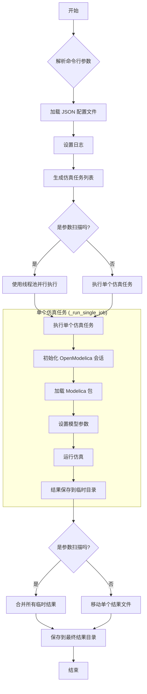
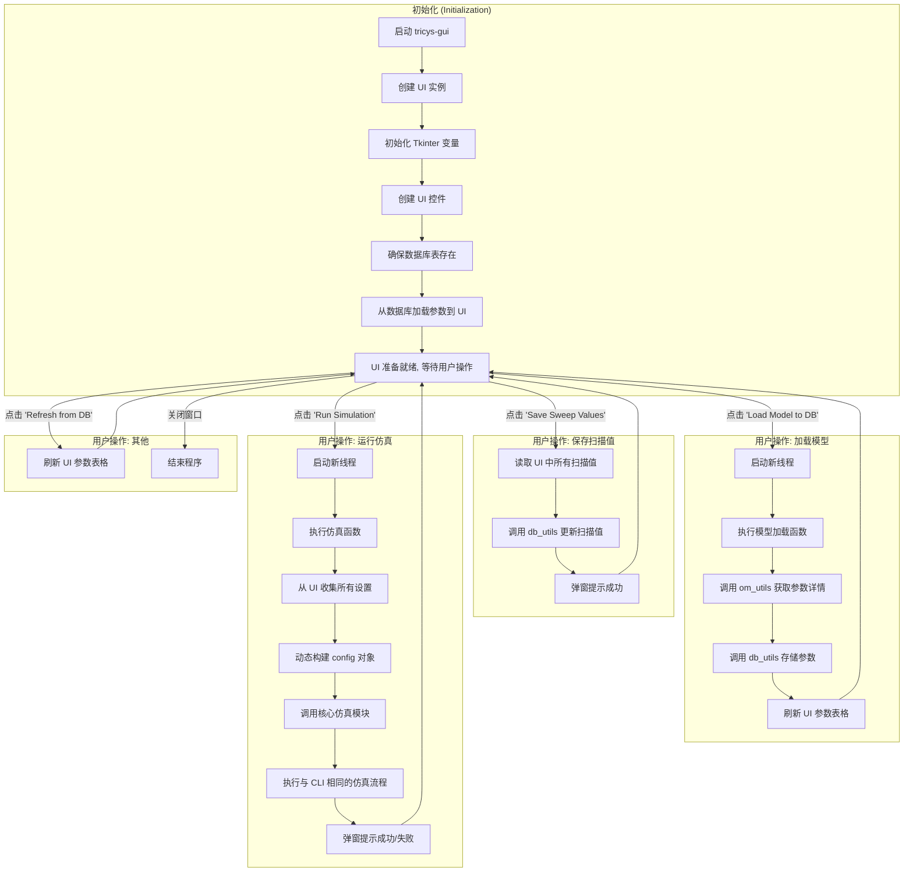

# tricys 用户手册

## 1. 项目简介

**tricys (TRitium Integrated CYcle Simulation)** 是一个用于分析聚变燃料循环的仿真系统，基于 OpenModelica 平台开发。该项目旨在通过建模和仿真，研究聚变反应堆燃料循环的动态行为，特别关注参数（如 `blanket.TBR`）对系统性能的影响。

为满足不同用户的需求，`tricys` 提供了两种操作模式：

*   **图形用户界面 (GUI)**: 提供一个直观的交互界面，用户可以方便地加载模型、设置仿真参数、定义参数扫描范围并启动仿真。
*   **命令行界面 (CLI)**: 通过配置文件驱动，支持复杂的参数扫描和批量仿真任务，适合进行大规模的自动化计算和集成到其他工作流程中。


## 2. 环境搭建

本项目利用 Docker 容器技术，封装了所有必需的依赖（包括 OpenModelica），确保了开发和运行环境的一致性，极大地简化了环境搭建流程。

### 2.1. 系统要求

*   **Docker**: 最新版本。
*   **VSCode**: 最新版本，并已安装 **Dev Containers** 插件。
*   **Git**: 用于克隆项目仓库。
*   **(Linux 用户)**: 在启动 GUI 之前，可能需要在终端执行 `xhost +local:` 命令，以允许容器访问主机的图形界面。

### 2.2. 安装步骤

1.  **克隆仓库**: 打开终端，克隆本项目到本地。
    ```bash
    git clone https://github.com/asipp-neutronics/tricys.git
    cd tricys
    ```

2.  **在 VSCode 中打开**:
    ```bash
    code .
    ```

3.  **在容器中重新打开**: VSCode 会检测到 `.devcontainer` 目录并提示“在容器中重新打开 (Reopen in Container)”，点击该按钮。
    ```
    注意: 首次构建容器时，需要下载指定的 Docker 镜像，可能需要一些时间。
    ```

4.  **安装项目依赖**: 容器成功启动后进入容器的终端，在终端中执行以下命令来安装项目所需的 Python 库。
    ```bash
    make dev-install
    ```

完成以上步骤后，您的开发环境便已准备就绪。

## 3. 图像仿真 (GUI)

图形用户界面提供了一种交互式的方式来运行仿真。

### 3.1. 启动 GUI

在容器的终端中，执行以下命令来启动 GUI：

```bash
cd /tricys/example && tricys-gui
```

### 3.2. 界面说明

GUI 界面主要分为两个部分：**设置 (Settings)** 和 **参数 (Parameters)**。


*   **设置区 (Settings)**:
    *   `Package Path`: Modelica 模型的 `package.mo` 文件路径。
    *   `Database Path`: 用于存储和管理模型参数的 SQLite 数据库文件路径。
    *   `Results Dir`: 存放最终仿真结果的目录。
    *   `Temp Dir`: 存放仿真过程中的临时文件的目录。
    *   `Model Name`: 要仿真的顶层 Modelica 模型名称 (例如 `example_model.Cycle`)。
    *   `Variable Filter`: 用于从结果中筛选特定变量的正则表达式，以减小输出文件的大小。
    *   `Stop Time`, `Step Size`: 仿真的总时长和步长。
    *   `Max Workers`: 在进行参数扫描时，允许并行运行的最大仿真任务数。
    *   `Logging`: 日志相关的配置。

*   **参数区 (Parameters)**:
    *   这是一个表格，用于显示和修改模型的参数。
    *   `Name`: 参数的完整名称。
    *   `Default Value`: 模型中定义的默认值。
    *   `Sweep Value`: **核心功能**。在此处为参数设置扫描范围。
    *   `Description`: 模型中对该参数的注释。

### 3.3. 操作流程

1.  **加载模型参数到数据库**:
    *   首先，正确填写 `Package Path` 和 `Model Name`。
    *   点击 **`Load Model to DB`** 按钮。程序会自动调用 OpenModelica 解析指定的模型，提取所有参数的详细信息（名称、默认值、注释等），并将其存储到 `Database Path` 指定的数据库文件中。
    *   加载成功后，参数表格会自动刷新并显示所有参数。

2.  **设置参数扫描**:
    *   在参数表格的 `Sweep Value` 列中，为您希望扫描的参数填入扫描值。支持三种格式：
        *   **单个值**: 直接输入一个数值，例如 `1.1`。
        *   **列表**: `[1.0, 1.5, 2.0]`
        *   **范围**: `1.05:1.15:0.05` (格式为 `起始值:结束值:步长`)。
    *   将某参数的 `Sweep Value` 留空，则在仿真时会使用其 `Default Value`。

3.  **(可选) 保存扫描配置**:
    *   点击 **`Save Sweep Values to DB`** 按钮，可以将当前填写的 `Sweep Value` 保存到数据库中，方便下次直接加载使用。

4.  **运行仿真**:
    *   确认所有配置无误后，点击 **`Run Simulation`** 按钮。
    *   仿真将在后台线程中运行，界面不会卡死。
    *   仿真结束后，会弹出“成功”或“失败”的提示框。

## 4. 命令仿真 (配置文件)

命令行模式通过一个 JSON 配置文件来驱动，非常适合执行非交互式的、自动化的仿真任务。

### 4.1. 启动命令

在容器的终端中，使用 `-c` 或 `--config` 参数指定配置文件路径来启动仿真：

```bash
cd /tricys/example && tricys -c example_config.json
```

### 4.2. 配置文件说明

让我们以 `example/example_config.json` 为例，解析其结构：

```json
{
    "paths": {
        "package_path": "example_model/package.mo",
        "db_path": "data/parameters.db",
        "results_dir": "results",
        "temp_dir": "temp"
    },
    "logging": {
        "log_level": "INFO",
        "log_to_console": true
    },
    "simulation": {
        "model_name": "example_model.Cycle",
        "variableFilter": "time|sds\\.I\\[1\\]",
        "stop_time": 5000.0,
        "step_size": 1.0,
        "max_workers": 4，
        "keep_temp_files": false,
        "concurrent": true
    },
    "simulation_parameters": {
        "blanket.T": [6, 12, 18],
        "blanket.TBR": "1.05:1.15:0.05",
        "i_iss.T": 18.0
    }
}
```

*   `paths`: 定义了所有必需的文件和目录路径。
*   `logging`: 控制日志的级别和输出方式。
*   `simulation`: 定义了仿真的核心参数，与 GUI 中的设置一一对应。
*   `simulation_parameters`: **核心部分**。在这里定义要覆盖的模型参数。
    *   如果一个参数有多个值（通过列表或范围字符串定义），程序会自动将这些参数进行组合（笛卡尔积），生成一系列独立的仿真任务，并并行执行它们。
    *   例如，上面的配置会产生 `3 * 3 * 1 = 9` 个独立的仿真任务。

## 5. 查看结果

仿真结果默认保存在 `results` 目录中。

*   **对于单次运行**:
    *   会生成一个名为 `simulation_results.csv` 的文件，其中包含 `time` 列和您筛选的变量列。

*   **对于参数扫描**:
    *   会生成一个名为 `sweep_results.csv` (或类似名称) 的组合文件。
    *   该文件的第一列是 `time`。
    *   其余每一列代表一次独立的仿真运行，列名由该次运行所使用的参数组合而成，例如 `blanket.T=6_blanket.TBR=1.05`。

您可以使用 Pandas、Excel 或其他数据分析工具来处理这些 CSV 文件。项目中的 `tricys/utils/plot_utils.py` 也提供了一些绘图函数，可供二次开发调用。

## 6. 查看日志以及中间结果

在进行复杂的仿真或问题排查时，查看程序运行日志和仿真过程产生的中间文件非常重要，其中同一次运行仿真的日志和中间文件的文件名都带有相同的时间戳以便于排查。

### 6.1. 日志文件

`tricys` 会记录详细的运行日志，帮助用户了解内部执行流程和排查错误。

*   **日志位置**:
    *   默认情况下，所有日志文件都保存在项目根目录下的 `log/` 目录中。
    *   您可以在 GUI 的 `Logging -> Log Directory` 设置中或在配置文件的 `logging.log_dir` 字段中修改日志保存位置。
*   **日志内容**:
    *   日志中记录了包括加载模型、生成仿真任务、调用 OpenModelica、执行每个仿真、合并结果等关键步骤的详细信息和时间戳。
    *   当仿真失败时，日志文件是定位问题的首要工具。
*   **日志管理**:
    *   程序会自动管理日志文件的数量。默认仅保留最新的5个日志文件，以避免占用过多磁盘空间。这个数量可以通过 GUI 的 `Log Count` 或配置文件的 `logging.log_count` 进行调整。

### 6.2. 中间结果 (Intermediate/Temporary Files)

在参数扫描过程中，`tricys` 会为每一次独立的参数组合运行一次仿真，并将每次的结果先保存为独立的临时文件，最后再合并成最终的 `sweep_results.csv`。

*   **临时文件位置**:
    *   默认情况下，这些中间结果文件保存在项目根目录下的 `temp/` 目录中。
    *   您可以在 GUI 的 `Settings -> Temp Dir` 或在配置文件的 `paths.temp_dir` 字段中修改该目录。
*   **保留中间文件**:
    *   默认情况下，为了节省空间，这些临时文件在仿真成功结束后会被 **自动删除**。
    *   如果您希望保留它们用于调试（例如，查看某次特定参数组合的原始输出），您可以：
        *   在 GUI 中，勾选 **`Keep Temp Files`** 选项。
        *   在配置文件中，将 `simulation.keep_temp_files` 设置为 `true`。


## 7. 程序说明 (流程图)

为了更清晰地理解程序的内部工作流程，以下是 GUI 和 CLI 两种模式的流程图。

### 7.1. 命令行模式 (`tricys`) 流程图



### 7.2. 图形界面模式 (`tricys-gui`) 流程图



### 7.3. 工具函数 API 说明 (Utils API)

本节详细介绍 `tricys/utils/` 目录下的工具模块所提供的核心函数，方便进行二次开发和功能扩展。

#### `db_utils.py` - 数据库工具

该模块负责与存储参数的 SQLite 数据库进行所有交互。

-   **`create_parameters_table(db_path: str) -> None`**
    -   **功能**: 在指定的数据库路径下创建一个名为 `parameters` 的表（如果该表尚不存在）。
    -   **参数**:
        -   `db_path`: 数据库文件的路径。

-   **`store_parameters_in_db(db_path: str, params_data: List[Dict[str, Any]]) -> None`**
    -   **功能**: 将从 Modelica 模型中提取的参数列表存储或更新到数据库中。
    -   **参数**:
        -   `db_path`: 数据库文件的路径。
        -   `params_data`: 包含参数详细信息的字典列表。

-   **`update_sweep_values_in_db(db_path: str, param_sweep: Dict[str, Any]) -> None`**
    -   **功能**: 更新数据库中指定参数的 `sweep_values` 字段，用于保存参数扫描的配置。
    -   **参数**:
        -   `db_path`: 数据库文件的路径。
        -   `param_sweep`: 一个字典，键为参数名，值为该参数的扫描配置。

-   **`get_parameters_from_db(db_path: str) -> List[Dict[str, Any]]`**
    -   **功能**: 从数据库中检索所有参数的详细信息。
    -   **参数**:
        -   `db_path`: 数据库文件的路径。
    -   **返回**: 包含所有参数信息的字典列表。

#### `file_utils.py` - 文件工具

该模块提供文件和目录管理的辅助函数。

-   **`get_unique_filename(base_path: str, filename: str) -> str`**
    -   **功能**: 如果文件名已存在，则通过附加计数器（如 `_1`, `_2`）的方式生成一个唯一的文件名。
    -   **参数**:
        -   `base_path`: 文件要保存的目录。
        -   `filename`: 原始文件名。
    -   **返回**: 一个唯一的、当前不存在的文件路径字符串。

-   **`delete_old_logs(log_path: str, max_files: int) -> None`**
    -   **功能**: 清理日志目录，根据文件的修改时间删除最旧的日志文件，使日志文件总数不超过 `max_files` 的限制。
    -   **参数**:
        -   `log_path`: 日志文件所在的目录。
        -   `max_files`: 希望保留的最大日志文件数量。

#### `om_utils.py` - OpenModelica 工具

该模块封装了与 OpenModelica (通过 `OMPython` 库) 的交互。

-   **`get_om_session() -> OMCSessionZMQ`**
    -   **功能**: 初始化并返回一个新的 OpenModelica 会话。
    -   **返回**: 一个 `OMCSessionZMQ` 会话对象。

-   **`load_modelica_package(omc: OMCSessionZMQ, package_path: str) -> bool`**
    -   **功能**: 将指定的 Modelica 包（`package.mo`）加载到 OpenModelica 会话中。
    -   **参数**:
        -   `omc`: OpenModelica 会话对象。
        -   `package_path`: `package.mo` 文件的路径。
    -   **返回**: 如果加载成功，返回 `True`，否则返回 `False`。

-   **`get_all_parameters_details(omc: OMCSessionZMQ, model_name: str) -> List[Dict[str, Any]]`**
    -   **功能**: 递归地遍历指定的 Modelica 模型，提取其所有组件的参数（`parameter`）的详细信息。
    -   **参数**:
        -   `omc`: OpenModelica 会话对象。
        -   `model_name`: 完整的模型名称 (例如 `example.Cycle`)。
    -   **返回**: 包含所有参数详细信息（名称、类型、默认值、注释等）的字典列表。

-   **`format_parameter_value(name: str, value: Any) -> str`**
    -   **功能**: 将参数值格式化为 OpenModelica 仿真时可以识别的字符串。
    -   **参数**:
        -   `name`: 参数的名称。
        -   `value`: 参数的值。
    -   **返回**: 格式化后的字符串 (例如 `blanket.TBR=1.1`)。

#### `plot_utils.py` - 绘图工具

该模块提供从仿真结果（CSV 文件）生成图表的函数。

-   **`plot_startup_inventory(...) -> str`**
    -   **功能**: 从参数扫描的组合结果中，绘制启动氚库存随两个变化参数的曲线图。
    -   **返回**: 生成的图片文件的保存路径。

-   **`plot_results(...) -> list`**
    -   **功能**: 从参数扫描的结果中，绘制指定变量的时间序列图。
    -   **返回**: 所有生成的图片文件路径的列表。
